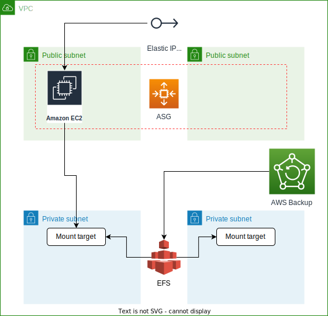

<!-- BEGIN_TF_DOCS -->
## Requirements

No requirements.

## Providers

| Name                                              | Version |
| ------------------------------------------------- | ------- |
|  [aws](#provider\_aws) | n/a     |

## Modules

| Name                                                                    | Source                                                    | Version |
| ----------------------------------------------------------------------- | --------------------------------------------------------- | ------- |
|  [backup\_role](#module\_backup\_role) | terraform-aws-modules/iam/aws//modules/iam-assumable-role | 4.14.0  |
|  [ec2\_sg](#module\_ec2\_sg)                | terraform-aws-modules/security-group/aws                  | 4.8.0   |
|  [efs\_sg](#module\_efs\_sg)                | terraform-aws-modules/security-group/aws                  | 4.8.0   |
|  [iam\_policy](#module\_iam\_policy)    | terraform-aws-modules/iam/aws//modules/iam-policy         | 4.14.0  |
|  [this\_role](#module\_this\_role)       | terraform-aws-modules/iam/aws//modules/iam-assumable-role | 4.14.0  |

## Resources

| Name                                                                                                                                               | Type        |
| -------------------------------------------------------------------------------------------------------------------------------------------------- | ----------- |
| [aws_autoscaling_group.this](https://registry.terraform.io/providers/hashicorp/aws/latest/docs/resources/autoscaling_group)                        | resource    |
| [aws_backup_plan.this](https://registry.terraform.io/providers/hashicorp/aws/latest/docs/resources/backup_plan)                                    | resource    |
| [aws_backup_selection.efs](https://registry.terraform.io/providers/hashicorp/aws/latest/docs/resources/backup_selection)                           | resource    |
| [aws_backup_vault.this](https://registry.terraform.io/providers/hashicorp/aws/latest/docs/resources/backup_vault)                                  | resource    |
| [aws_efs_file_system.this](https://registry.terraform.io/providers/hashicorp/aws/latest/docs/resources/efs_file_system)                            | resource    |
| [aws_efs_mount_target.this](https://registry.terraform.io/providers/hashicorp/aws/latest/docs/resources/efs_mount_target)                          | resource    |
| [aws_eip.this](https://registry.terraform.io/providers/hashicorp/aws/latest/docs/resources/eip)                                                    | resource    |
| [aws_iam_instance_profile.this_instance_profile](https://registry.terraform.io/providers/hashicorp/aws/latest/docs/resources/iam_instance_profile) | resource    |
| [aws_launch_template.this](https://registry.terraform.io/providers/hashicorp/aws/latest/docs/resources/launch_template)                            | resource    |
| [aws_ami.amazon_linux_2](https://registry.terraform.io/providers/hashicorp/aws/latest/docs/data-sources/ami)                                       | data source |
| [aws_iam_policy_document.this](https://registry.terraform.io/providers/hashicorp/aws/latest/docs/data-sources/iam_policy_document)                 | data source |
| [aws_region.current](https://registry.terraform.io/providers/hashicorp/aws/latest/docs/data-sources/region)                                        | data source |

## Inputs

| Name                                                                                                                                                        | Description                                                                          | Type                                                                                                                                                              | Default      | Required |
| ----------------------------------------------------------------------------------------------------------------------------------------------------------- | ------------------------------------------------------------------------------------ | ----------------------------------------------------------------------------------------------------------------------------------------------------------------- | ------------ | :------: |
|  [encrypted](#input\_encrypted)                                                                                               | Encrypt or not EFS                                                                   | `bool`                                                                                                                                                            | `true`       |    no    |
|  [environment](#input\_environment)                                                                                         | Environment name                                                                     | `string`                                                                                                                                                          | `"infra"`    |    no    |
|  [ingress\_with\_cidr\_blocks](#input\_ingress\_with\_cidr\_blocks)                                            | A list of Pritunl server security group rules where source is CIDR                   | <pre>list(object({     protocol    = string     from_port   = string     to_port     = string     cidr_blocks = string   }))</pre>                 | `[]`         |    no    |
|  [ingress\_with\_source\_security\_group\_id](#input\_ingress\_with\_source\_security\_group\_id) | A list of Pritunl server security group rules where source is another security group | <pre>list(object({     protocol        = string     from_port       = string     to_port         = string     security_groups = string   }))</pre> | `[]`         |    no    |
|  [instance\_type](#input\_instance\_type)                                                                                 | Pritunl server instance type                                                         | `string`                                                                                                                                                          | `"t3.small"` |    no    |
|  [kms\_key\_id](#input\_kms\_key\_id)                                                                                        | KMS key ID in case of using CMK                                                      | `any`                                                                                                                                                             | `null`       |    no    |
|  [name](#input\_name)                                                                                                              | Name used for all resources in this module                                           | `string`                                                                                                                                                          | `"pritunl"`  |    no    |
|  [private\_subnets](#input\_private\_subnets)                                                                           | A list of private subnets where EFS will be created                                  | `list(any)`                                                                                                                                                       | n/a          |   yes    |
|  [public\_subnets](#input\_public\_subnets)                                                                              | A list of public subnets where Pritunl server will be run                            | `list(any)`                                                                                                                                                       | n/a          |   yes    |
|  [vpc\_id](#input\_vpc\_id)                                                                                                      | ID of the VPC where to create security groups                                        | `string`                                                                                                                                                          | n/a          |   yes    |

## Outputs

| Name                                                                                                       | Description |
| ---------------------------------------------------------------------------------------------------------- | ----------- |
|  [pritunl\_endpoint](#output\_pritunl\_endpoint)                     | n/a         |
|  [pritunl\_security\_group](#output\_pritunl\_security\_group) | n/a         |
<!-- END_TF_DOCS -->

## Architecture diagram

## Description
* AWS ASG is used to automatically run "broken" instance again
* The entire logic is located in user-data script:
  * Install MongoDB
  * Install Pritunl-server
  * Configure sysctl
  * Attache Elastic IP
  * Disable source-destination check, because this instance will forward traffic
  * Mount EFS filesystem into directory with MongoDB data. We don't want to care about AZ and EBS disks
* AWS Backup is configured to backup EFS storage
